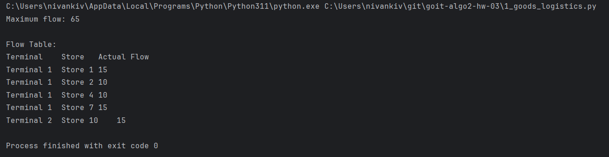
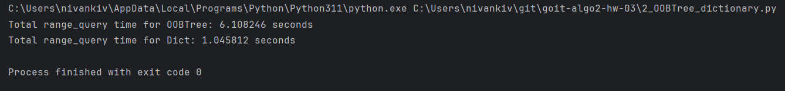

# goit-algo2-hw-03

## Results:

### Task1:

1. Які термінали забезпечують найбільший потік товарів до магазинів?
Висновок:

Термінал 1 забезпечує більший потік товарів (загалом 50 одиниць).

2. Які маршрути мають найменшу пропускну здатність і як це впливає на загальний потік?

Найменші пропускні здатності спостерігаються: Store 13: 5 одиниць

3. Які магазини отримали найменше товарів і чи можна збільшити їх постачання, збільшивши пропускну здатність певних маршрутів?

Магазини з найменшими потоками: Store 2: 10 одиниць Store 4: 10 одиниць

4. Вузькі місця:

Склад 4 має багато з'єднань із магазинами з низькими пропускними здатностями, наприклад, Store 13 (5 одиниць) і Store 14 (10 одиниць). Пропускна здатність від Терміналів до Складів (наприклад, Термінал 2 → Склад 2, 10 одиниць) обмежує можливий потік.

Рекомендації:
Збільшити пропускну здатність на вузьких маршрутах, наприклад, між Терміналами та Склади. Оптимізувати потоки, перенаправивши товари до складів із кращою пропускною здатністю до магазинів.

### Task2:

#### Висновок:

Для даного набору даних Dict виявився на багато швидшим.